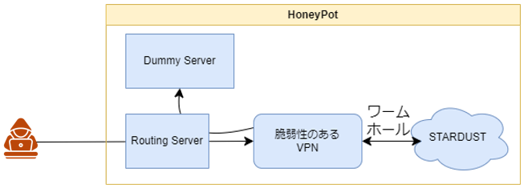

# 進捗報告240925

## 前回の課題
- PoCの作成
  - エラーが起きたり、わからないことが多く、調べながら進めている(が、ある意味サイバー攻撃なので情報はあまり出てこない)。正直次の報告会でも完成を報告できるかどうかがわからない。<-前回と状況変わらず
- STARDUSTについての調査
  - STARDUSTの内部構造について、9/9の講習会のアーカイブが出たら作成方法を学んでいきたい。<-前回と方針変わらず
  - STARDUSTの機能として存在しているワームホールについての取り扱いの方針決定(後述)
 
## 今週行ったこと
- ワームホールについての方針決定
  - STARDUSTの構造
    - STARDUSTはワームホールを用いることで、外に出る通信について、外部に影響を及ぼさないようなものだけを通すと謳っているが、その性能について疑問。->彦坂さんと考えが一致。
  - VPNが踏み台とされることはあってはならないので、ひとまずダミーサーバに送る。そのうちワームホール前後で落とされた通信を確認することで、性能の検証を行いたい。
- 実験を行う際の構築
  - ワームホールが信頼できないため、今回はダミーサーバを使用-> 溝口さんが以前使用したような構造になりそうだと予想。以下のような構造になる

- FortiGateに送られてはいけない通信の調査
  - 現状考えているのがアップデート
    - FortiGateのアップデートは、商品を買った時にもらえる証明書に記載されているパスワードが必要->西舘さんに伺ったところ、無いそう。
    - 証書が無い以上、おそらく攻撃者もアップデートできないとは思うが、一応落としたい。
    - それ以外の変化は可逆的であると予想...(これから調査)

### 次回の方針
今まで脆弱性のPoCについて調査を行っていたが、全く進められていない -> PoC公開者が前提としている知識を持ち合わせていない。
- 脆弱性のあるVPNとして使用しようと考えているFortiGateについて、機能を調査し、もっとよく知ることを目標としたい...
