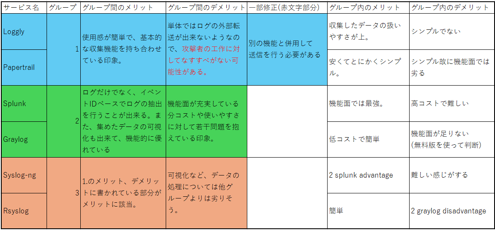

# Progress Report

## Contents
- What I did in this 2 weeks and before 2 weeks
- Problems and Questions
- My assignments
## What I have done more than 2 weeks ago and assignment in this 2 weeks
### What I have done
1. I want to use STARDUST to observe what cyber crimers do in company Internet environment ->
2. I need to know what cyber attackers can do and how I can observe that ->
3. I used WireShark and Sysmon. Sysmon is a tool related to event logs.
In a STARDUST workshop, it was used to analyze malware behavior,but when observing cyber-attacks on companies,
I may need to find other services because some types of logs may not be captured by sysmon alone.
4. I found 6 services to replace sysmon↓↓

5. 
## Problems and Questions

## What I will do in this week
