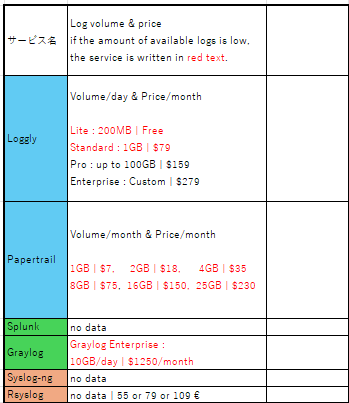

# Progress Report

## Agenda
- Progress in this 2 weeks and before 2 weeks
- Problems and Questions
- My assignments
## What I have done more than 2 weeks ago and assignment in this 2 weeks
### What I have done
1. I want to use STARDUST to observe what cyber crimers do in Internet environment ->
2. I need to know what cyber attackers can do and how I can observe that ->
3. I used WireShark and Sysmon. 
    - Sysmon is a tool related to event logs.
    - In a STARDUST workshop, it was used to analyze malware behavior,but when observing cyber-attacks on companies,
    - I may need to find other services because some types of logs may not be captured by sysmon alone.
4. I found 6 services that can replace sysmon↓↓

6 services have different advantages, but these information are not reliable because I found them by using ChatGPT.
I need to brush up this table.

### What I did
1. Think how to improve this table. I got advices that I should focus on logs that I can get and price.

    - About logs
      - Back bround
        - **What logs are** thought to be **related to cyber attacks against companies?**
         - I found interesting paper
            - National Security Agency provide a table of all the event codes that they find interesting for detecting baddies in windows network.(Windows 7,8 and this article was published 10 years before)
             - I couldn't find this type of paper written recently
            - Some articles show some logs, but not all logs are not same.
        - What logs are related to cyber attacks -> Overview is known, but details are not known...
      - I had to gather logs from STARDUST.
        - ffri yarai is used to get client log, but it is not good for honeypot.
      - I installed a service to send event log to syslog, and the amount of data was 6-7MB in 400seconds. -> STARDUST's event log per day may be 75GB(I will check later.)
    - About prices
      - Some services depends on the amount of data of logs per day or month
      - When we can use services (per day -> 100GB per month -> 3000GB), we will have no 
    problems about log volume...? -> I changed contracts not suitable due to data volume to red color

    

What service is good for our research ...?

- Unlike the other four services, syslog-ng and rsyslog are not services that are deployed primarily for log analysis.

Now, I will focus on 3 services. Loggly, Papertrail, and Splunk.

2. Loggly vs Papertrail vs Splunk
How I should choose from these services -> 
    - I want to capture all event logs -> I know they have at least 1 way to capture them.
    - I want additional function , ex : visible function
      - Loggly pro. vs company.
        Pro is good for analyzing,and company contract is good for workers and analyzing some types of log.
    - anomaly detection : loggly (company) and splunk
## Problems and Questions
- Is my method of measuring the amount of data collect ?
## What I will do in this week
I want to determine which service to use and contact to splunk
