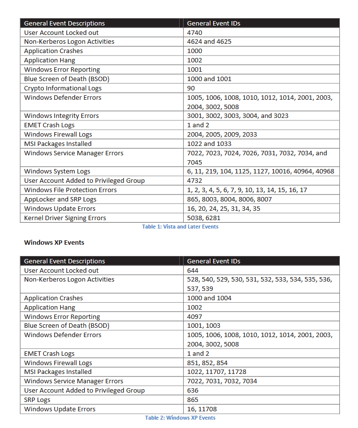

# 進捗報告

## Agenda
- 今までの進捗と、最近2週間の進捗
- 課題と疑問
### 今までの進捗
1. 私の研究の目標は、STARDUSTで企業のインターネット環境を模倣することによって、サイバー攻撃者がどのような挙動をしているのか観察することである。 ->
4. そのためには、攻撃者が何をしていて、私はどのようにしてそれを知ることが出来るか知る必要がある。 ->
7. 私はWiresharkとsysmonを用いることで、それについて学習した。
   - Sysmon はイベントログを収集するためのツールであり、STARDUSTの講習会では、マルウェアによって発生したログをとるために用いられていたが、今回の実験においては収集しきれないログがありそうなので、相性はあまりよくない可能性がある。そのため、Sysmonの代わりとなるようなサービスを見つける必要がある。 ->
8. 以下がSysmonの代わりとなりそうなサービスである。

今回は6つのサービスを選出したが、これらの情報はChatGPTを基に作成しているので、誤りがある可能性がある。そのため、もっと精度の良い表を作成する必要がある。

### 最近2週間の進捗
1. 取得することができるログと料金に焦点を当てて調査を行った。
   - ログについて
     - 現在、どのようなイベントログが企業ネットワークへのサイバー攻撃と関連があると考えられているのかを知るため、調査を行った。
       - 複数のサイトで共通して指摘されているログもあったが、片方でしか指摘されていないログももちろんあった。ただし、2014年頃に発表された資料にはかなりの量のログが記載されていたので、私が見逃しているだけの可能性もある。

      出典 : https://cryptome.org/2014/01/nsa-windows-event.pdf 
      
      - まとめると、どのようなログがサイバー攻撃に関わっているのかがある程度判明している一方で、完全には判明していないと考えた。
      - ffri yaraiもログデータを収集するサービスの1つではあるが、異常検出を行い収集するようなので、攻撃中のログの取りこぼしを考慮すると、攻撃者の完全な行動把握にはつながらない可能性があるので使わない方針。
      - このため、収集するログについては制限を設けないでおきたいと考えている(すべてとる)。
   - 料金について
     - Graylogのように、最初から値段が確定しているようなサービスもあれば、ログの量によって値段が決まるようなサービスもあることが分かった。
       
     

     - そのため、STARDUST全体で出ているログの量を知ることが重要ではないかと考え、テナント273のWin05において、オープンソースであるnxlogを用いて送信を行い、それをWireSharkでキャプチャすることで1時間あたりのすべてのイベントログのデータ量を測定した。結果は64MB/hである。ただし、ほぼ毎回ackが届く前にイベントログが再送されているので、うまく工夫すれば30MB/h程度になる可能性もある。(今回は64MB/hとします。)すると、STARDUST全体で1日に発生するログのデータ量は、64 * 50(クライアント数) * 24(h) ≒ 80GB/day であると見積もった。
     - 上記のログデータの条件に合致しない契約を赤色にして示したのが以下の図である。

      

syslog-ng, rsyslogはログの解析と少し違う方面のサービスなので、データ量が足りなそうなGraylogとともに除去すると、以下の3サービスが候補として残った。

Loggly,Papertrail,Splunkである。これらはいずれもnxlogを使用してログ収集が出来るので、すべてのログの収集は可能である。

## Problems and Questions
- 私の行っている調査方法が正しいかどうか
- すべてのログをとるという手法が必ずしも正しいかどうか
- どのような点を重視してこの3つから選出をおこなうべきか
## What I will do in this week
この3つの中から選出するのと、splunkにコンタクトをとってみる。

