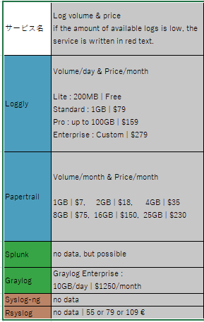

# 進捗報告

## Agenda
- 今までの進捗と、最近2週間の進捗
- 課題と疑問
### 今までの進捗
1. 私の研究の目標は、STARDUSTで企業のインターネット環境を模倣することによって、サイバー攻撃者がどのような挙動をしているのか観察することである。 ->
4. そのためには、攻撃者が何をしていて、私はどのようにしてそれを知ることが出来るか知る必要がある。 ->
7. 私はWiresharkとsysmonを用いることで、それについて学習した。
   - Sysmon はイベントログを収集するためのツールであり、STARDUSTの講習会では、マルウェアによって発生したログをとるために用いられていたが、今回の実験においては収集しきれないログがありそうなので、相性はあまりよくない可能性がある。そのため、Sysmonの代わりとなるようなサービスを見つける必要がある。 ->
8. 以下がSysmonの代わりとなりそうなサービスである。

今回は6つのサービスを選出したが、これらの情報はChatGPTを基に作成しているので、誤りがある可能性がある。そのため、もっと精度の良い表を作成する必要がある。

### 最近2週間の進捗
1. 取得することができるログと料金に焦点を当てて調査を行った。
   - ログについて
     - 現在、どのようなイベントログが企業ネットワークへのサイバー攻撃と関連があると考えられているのかを知るため、調査を行った。
       - 複数のサイトで共通して指摘されているログもあったが、片方でしか指摘されていないログももちろんあった。ただし、2014年頃に発表された資料にはかなりの量のログが記載されていたので、私が見逃しているだけの可能性もある。

      
   - 料金について
     - Graylogのように、最初から値段が確定しているようなサービスもあれば、ログの量によって値段が決まるようなサービスもあることが分かった。

     - そのため、STARDUST全体で出ているログの量を知ることが重要ではないかと考え、テナント273のWin05において、オープンソースであるnxlogを用いて送信を行い、それをWireSharkでキャプチャすることで1時間あたりのすべてのイベントログのデータ量を測定した。結果は64MB/hである。ただし、ほぼ毎回ackが届く前にイベントログが再送されているので、うまく工夫すれば30MB/h程度になる可能性もある。(今回は64MB/hとします。)すると、STARDUST全体で1日に発生するログのデータ量は、64 * 50(クライアント数) * 24(h) ≒ 80GB/day であると見積もった。
1. Think how to improve this table. I got advices that I should focus on logs that I can get and price.

    - About logs
      - Back bround
        - **What logs are** thought to be **related to cyber attacks against companies?**
         - I found interesting paper
            - National Security Agency provide a table of all the event codes that they find interesting for detecting baddies in windows network.(Windows 7,8 and this article was published 10 years before)
             - I couldn't find this type of paper written recently
            - Some articles show some logs, but not all logs are not same.
        - What logs are related to cyber attacks -> Overview is known, but details are not known...
      - I had to gather logs from STARDUST.
        - ffri yarai is used to get client log, but it is not good for honeypot.
      - I installed a service to send event log to syslog, and the amount of data was 6-7MB in 400seconds. -> STARDUST's event log per day may be 75GB(I will check later.)
    - About prices
      - Some services depends on the amount of data of logs per day or month
      - When we can use services (per day -> 100GB per month -> 3000GB), we will have no 
    problems about log volume...? -> I changed contracts not suitable due to data volume to red color

    

What service is good for our research ...?

- Unlike the other four services, syslog-ng and rsyslog are not services that are deployed primarily for log analysis.

Now, I will focus on 3 services. Loggly, Papertrail, and Splunk.

2. Loggly vs Papertrail vs Splunk
How I should choose from these services -> 
    - I want to capture all event logs -> I know they have at least 1 way to capture them.
    - I want additional function , ex : visible function
      - Loggly pro. vs company.
        Pro is good for analyzing,and company contract is good for workers and analyzing some types of log.
    - anomaly detection : loggly (company) and splunk
## Problems and Questions
- Is my method of measuring the amount of data collect ?
## What I will do in this week
I want to determine which service to use and contact to splunk

