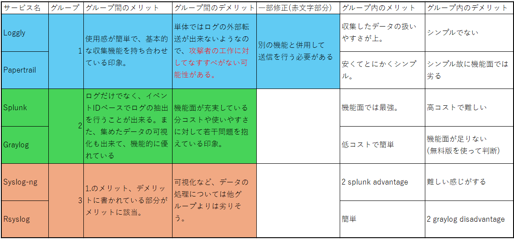

# Progress Report(December 11th)
## Previous Progress
- Progress more than 1 week ago
- Progress in this week

### Progress more than 1 week ago
1. I want to gain insight into cyber attacks against company network.
2. STARDUST is a base for observing cyber attacks. I want to use that.
3. I have to know what attackers do to our environment. So, I did some types of communication and captured event logs and contents of communication.
   - I used Sysmon to capture event logs and Wireshark to observe communications. 
5. Sysmon is useful, but some event logs are not captured. 
So, I have to look for a service that will not miss any event logs. (A table below)
   

7. I chose 6 services, however, all the information in the table was obtained from chatgpt. Therefore, it was necessary to check if the information is correct.
8. I did some research on prices and the logs that can be collected. I also investigated the amount of logs generated by STARDUST.
   - I conducted a survey of one client in STARDUST. The amount of logs was about 30MB/h. There are 50 clients in STARDUST. So, the amount of logs generated by STARDUST per day was estimated at 36GB (30MB * 50(number of clients) * 24h/d * 0.001(GB/MB) = 36GB)
   - I used NXLog to investigate the amout of logs. This is because all types of logs can be sent by using this service. 
9. I think I have to obtain all logs from all Clients. This is because missing logs makes it difficult to observe attackers' behavior. I must choose a service that the number of volume that I can send per day is at least 30GB. Inappropriate services are written in red text.

8. syslog-ng and rsyslog are not used to observe event logs. So, appropriate services are Loggly, Papertrail and Splunk.
9. For these services, it is possible to bring log data by using nxlog. So, We have at least 1 way to bring all types of log datas.
    - Loggly, Papertrail, Splunk are appropriate in terms of the amount of data that I can use and types of log data that I can capture. 

### Progress in this week
1. I did an research about functions of 3 services.
      - Loggly Pro. vs Enterprise.
   - Papertrail Custom
   - Splunk Enterprise. vs Cloud.
3. Loggly Pro. vs Enterprise
   ### Prices
   | Package | Price | amount of log data capturable | How long data retained? |
   | --- | --- | --- | --- |
   | Pro | 159$/m | 100GB/d | 15-30d |
   | Enterprise | 279$/m | custom | 15-90d |
   ### Functions
   | Function | Available in Pro? | Available in Enterprise? | helpful to have that? |
   | --- | --- | --- | --- |
   |multiple users can use same instance|〇|〇|〇|
   |All logs can be managed centrally. NXLog will be used to bring logs to Loggly|〇|〇|〇|
   |Automatic analysis can extract only the necessary logs.(It will be useful for looking for traces of cyber attacks)|〇|〇|〇|
   |A dashboard function that visually indicates information obtained from automatic analysis. It will be essential for handling large amount of data.|〇|〇|〇|
   |Alert function(email).We can define triggering criteria. |〇|〇|〇|
   |Filter function is available. For example, we can gather logs from Client A. |〇|〇|〇|
   |If large amount of data are suddenly generated and the amount of data exceeds the contracted amount, Loggly will capture up to 50GB over. This service is available 3 times per month. |〇|〇|〇|
   | Windows logs past retention period can be archived in Amazon S3 packets　|〇|〇|〇|
   |Contracted amount of data can be variable. We may change the contract when we sprinkle bites or months when cretain cyber attacks are likely to occur more |×|〇|?|
   |Access control about logs.|×|〇|×|
   |Anomaly detection. We can know which logs have increased/decreased. Very important isn't it? |×|〇|〇|
   
   jira ticket and github integration are available with Enterprise contract.
   alert function has synergy with anomaly detection. I think Enterprise is better.

5. Papertrail
   - We can use only 1 offer : Custom (because of log volume...)
     
   ### functions featured in website
   1. Live Tail : Papertrail`s event viewer is real time.
   3. Log Velocity Analytics
      - Troubleshoot a spike in last 10 minutes
      - Spot trends over the last 2 weeks.
      - Jump to a specific time
   4. Saved Searchers
      - We can save useful log search, and we can search that easily.
   5. Skim-Ability : User interface. 
   6. APM(Application Performance Monitoring) Integration (<- also available loggly)
      - If we need to know app behavior,  we can use another app.
      - Same as Context.  
   8. Elegant Search
      - Event viewer is live. While we are searching older logs, new logs appear in real time.
      - Exclusion search will filter oout ur routine events.
      - Alerts email us when something unusual happen. (<- we can define)  
   9. Context
      - It is like Wireshark follow tcp stream. It is useful.
   10. Seek By Time
      - We can junp to a specific time easily.
      - We can use our time zone.
   - When we Investigate what attackers do, high-level filter function will be required. 
6. Splunk
   - I couldn't find sites like loggly and papertrail, but ChatGPT says that Splunk has all loggly's function.
   ### About Splunk Cloud. vs Splunk Enterprise.
   - Each service is used for log security.
   - Since Splunk Enterprise allows us to be directly involved in the system, while Splunk Cloud allows the person in charge to manipulate the system, we thought Splunk Enterprise would be more suitable for frequent system changes.
8. Conclusion
   - Funcion : Splunk > Loggly > Papertrail
   - Price : Splunk ≒ Papertrail > Loggly
   - If Loggly's functions fulfill our wishes, we can use that. On the contrary, if it is not good enough, we must use Splunk(or do research again).
9. How to implement this service in STARDUST environment...?
   - I think that we need to store logs in a place where attackers cannot access, but Wireshark may imply where the storage is. So, we should install that within the STARDUST environment...?
   - 1st solution is prohibiting RDP connection to the storage client.  I want to know how it looks to attackers.
   - 2nd solution is to place the logging client outside, so that only communications originating from within the STARDUST environment would pass through.
